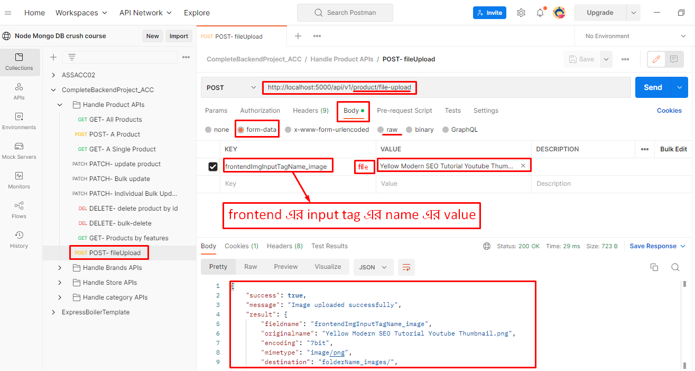

# Multer কিভাবে ব্যবহার করব??

- প্রথমে link generate করে upload করা
- সরাসরি upload system
- একটা file upload
- একাধিক file upload
- most efficient way to upload file

## Uploading a single file

1. যেহেতু multer আমাদের একটা middleware return করে তাই আমাদেরকে এর জন্য একটা middle ware function create করতে হবে

> > প্রথমে **_multer ও path_** module কে import করে নিতে হবে
>
> > তারপর **_multer_** module এর default **_diskStorage()_** method use করে file store করার pathname এবং file নামে save হুবে তা যথাক্রমে **_destination ও filename-function_** এ বলে দিতে হবে
> >
> > > file store করার pathname অবশ্যই file upload করার আগে থেকেই create করা থাকতে হবে নইলে error আসবে
> > > আর **filename** function 3টা parameter recive করে এবং সবশেষে fucntion টা এমন ভাবে সাজাতে হবে যেন প্রতিটা file এর নাম আলাদা আলাদা হয় এখানে **time & random** number use করা হয়েছে
>
> > **_multer_** এর সাহায্যে storage, fileFilter, limits set করে দেয়া হয়েছে যাতে নির্দিষ্ট ranger এর ও নির্দিষ্ট type এর file ই কেবল ঐ নির্দিষ্ট filepath এ গিয়ে upload হতে পারে
> >
> > > এখানে file size কে limit করার সময় অবশ্যই **_Bytes_** এ mention করে দিতে হবে

```http
[[[ FilePath : D:\projectsACC\Node-Mongo Advanced Crash Course\ACCcompleteBackend\middleware\multerUploader.js]]]
"""""""""""""""""""""""""""""""""""""""""""""""""""""""""

const multer = require("multer");
const path = require("path");

const storage = multer.diskStorage({
  destination: "folderName_images/", // folder name to store files but it must be pre-created before uploading
  filename: function (req, file, cb) {
    const uniqueSuffix = Date.now() + "-" + Math.round(Math.random() * 1e9);
    cb(null, uniqueSuffix + "-" + file.originalname);
  }, // generate unique file name
});

const uploader = multer({
  storage, // showing storage and naming function
  fileFilter: (req, file, cb) => {
    const fileTypes = /jpeg|jpg|png|gif/; // allowed file extensions
    const extName = path.extname(file.originalname); // get file extension name from original file name of frontend
    if (fileTypes.test(extName)) {
      return cb(null, true); // if file extension name is matched with allowed file extensions then return true
    } else {
      cb(new Error("Only jpeg|jpg|png|gif images are allowed")); // if file extension name is not matched with allowed file extensions then return error
    }
  },
  limits: {
    fileSize: 1024 * 1024 * 5, // 5MB max file size
  },
});

module.exports = uploader;

```

2. এবার **controller** function create করতে হবে

> > এই controller file আর কিছু না শুধু frontend থেকে **_req.file_** এ যা আসবে কেবল তাই আবার response হিসেবে পাঠিয়ে দিবে
> >
> > > এখানে কিন্তু file টা frontend থেকে **_req.file_** এর ভিতরে আসতেছে যার ফলে frontend থেকে পাঠানোর system + **_postman_** এ requesting এর system ও আলাদা হবে

```http
[[[ FilePath : D:\projectsACC\Node-Mongo Advanced Crash Course\ACCcompleteBackend\controllers\v1\Products.Controller.js]]]
"""""""""""""""""""""""""""""""""""""""""""""""""""""""""
exports.fileUpload = async (req, res, next) => {
  try {
    res.status(200).json({
      success: true,
      message: "Image uploaded successfully",
      result: req.file,
    });
  } catch (error) {
    res.status(400).json({
      success: false,
      message: error.message,
    });
  }
};

```

3. এবার এই **_fileUpload_** controller function এর জন্য একটা **_/ product/file-upload_** route বানাতে হবে যেখানে **_uploader_** method এর কিছু কাজ থাকবে

> > প্রথমে **_uploader_** কে import করে নিয়ে আসতে হবে
>
> > তারপর routing এর সময় **_controller_** function এর আগে middleware হিসেবে **_uploader.single()_** method use করতে হবে
> >
> > > এখানে **_.single_** method কেবল তখন ই use করা যাবে যখন frontend থেকে একটা মাত্র file আসবে । একাধিক্ক file এর জন্য তখন আলাদা method.
> >
> > > **_.single_** method এর ভতরে frontend থেকে file টা যেই **input or form** tag এর সাহায্যে আসতেছে তার **_name_** value কে দিতে হবে এক্ষেত্রে **frontendImgInputTagName_image**

```http
[[[ FilePath : D:\projectsACC\Node-Mongo Advanced Crash Course\ACCcompleteBackend\routes\v1\Products.Route.js]]]
"""""""""""""""""""""""""""""""""""""""""""""""""""""""""
const express = require('express');
const router = express.Router();
const uploader = require('./../../middleware/multerUploader');

const ProductController = require('../../controllers/v1/Products.Controller');


// multer use case1: একটা নতুন route বানিয়ে তার সাহায্যে file upload প্রথমে link generate করে upload করা তারপর সেটা ডাটাবেজে সেভ করা
router.route('/product/file-upload').post(uploader.single("frontendImgInputTagName_image"), ProductController.fileUpload);


module.exports = router;
```

4. postman testing


